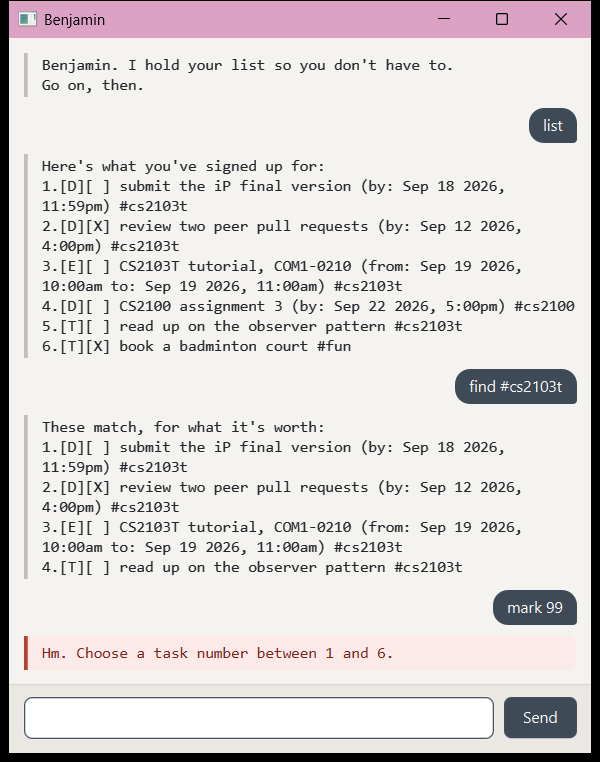

# Benjamin

Benjamin is a desktop task tracker for people who would rather type than click.
He keeps your todos, deadlines and events, remembers them between sessions, and
is faintly unimpressed by all of them.



## Quick start

1. Make sure you have **Java 25** installed. Check with `java -version`.
2. Download `benjamin.jar` from the [latest release](https://github.com/Shir0-Kage/ip/releases).
3. Put it in a folder of its own. Benjamin saves your list beside it, in `data/benjamin.txt`.
4. Open a terminal in that folder and run:

   ```
   java -jar benjamin.jar
   ```

5. Type a command, press Enter. Start with `list`.

## Commands at a glance

Everything is case insensitive, and extra spaces are ignored.

| Command | What it does |
| --- | --- |
| `list` | Show everything on the list |
| `todo DESCRIPTION` | Add a task with no date |
| `deadline DESCRIPTION /by WHEN` | Add a task due at a particular time |
| `event DESCRIPTION /from WHEN /to WHEN` | Add something that runs between two times |
| `mark NUMBER` / `unmark NUMBER` | Change whether a task is done |
| `delete NUMBER` | Remove a task |
| `find TEXT` | Show tasks whose description or tags contain the text |
| `on WHEN` | Show tasks falling on a particular date |
| `tag NUMBER TAG` / `untag NUMBER TAG` | Attach or remove a label |
| `bye` | Close the window |

## Adding tasks

There are three kinds of task.

```
todo read up on the observer pattern
deadline submit the iP final version /by 2026-09-18 2359
event CS2103T tutorial /from 2026-09-19 1000 /to 2026-09-19 1100
```

Benjamin replies with the task he has recorded and how many things are now on
your list:

```
Fine. Added:
  [D][ ] submit the iP final version (by: Sep 18 2026, 11:59pm)
That's 4 things on the list.
```

`[T]`, `[D]` and `[E]` mark the kind of task. `[X]` means done.

An event must finish after it starts, and you cannot add the same task twice.

### Writing dates and times

Any of these work, with or without a time:

| Format | Example |
| --- | --- |
| `yyyy-MM-dd` | `2026-09-18` |
| `yyyy-MM-dd HHmm` | `2026-09-18 2359` |
| `d/M/yyyy` | `18/9/2026` |
| `d/M/yyyy HHmm` | `18/9/2026 2359` |

Dates that do not exist are refused rather than quietly moved, so `2026-02-30`
gets you a complaint instead of the 28th.

## Getting things done

```
mark 2
unmark 2
delete 5
```

Task numbers come from whatever Benjamin last showed you, so run `list` first if
you are not sure.

## Finding things

`find` matches descriptions and tags:

```
find observer
find #cs2103t
```

`on` shows what falls on a particular day. Events count for every day they span.

```
on 2026-09-19
```

## Tagging

Labels group tasks that have nothing else in common.

```
tag 1 #cs2103t
untag 1 #cs2103t
```

The `#` is optional and case does not matter, so `#CS2103T` and `cs2103t` are the
same tag. Add one at a time. Tags may contain letters, digits, hyphens and
underscores.

## Saving

There is no save command. Benjamin writes `data/benjamin.txt` after every change
and reads it back when he starts. If a line of that file has been damaged, he
reports the line number, skips it, and keeps the rest.

## When something goes wrong

Complaints appear in their own red panel and say what to fix:

```
Hm. Choose a task number between 1 and 6.
Hm. You gave /by more than once. Please use it just once.
Hm. A description cannot contain the | character, because that is what
separates fields in the save file.
```

## Acknowledgements

Benjamin was written by Zhou Zehao ([@Shir0-Kage](https://github.com/Shir0-Kage))
for CS2103T.

Third-party libraries used:

| Library | Used for |
| --- | --- |
| [OpenJFX](https://openjfx.io/) 17.0.7 | the graphical interface |
| [JUnit 5](https://junit.org/junit5/) | the automated tests |
| [Gradle Shadow](https://gradleup.com/shadow/) | packaging the runnable JAR |

**Use of AI tools.** Claude Code (Anthropic) was used extensively throughout this
project by the author: to write and refactor production and test code, to draft
Javadoc, commit messages and this user guide, and to review the code against the
course's Java and Git conventions. All of it was directed and reviewed by the
author.

Structure and configuration were adapted from course materials: the
[JavaFX tutorial](https://se-education.org/guides/tutorials/javaFx.html) for the
GUI, and [AddressBook Level 3](https://github.com/se-edu/addressbook-level3) for
the Checkstyle configuration and the GitHub Actions workflow.
